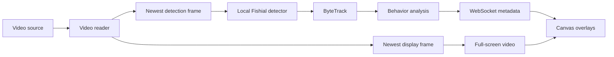

# SalmonSight

SalmonSight is a video-first local fish tracking app. It uses the pretrained Fishial general-fish detector, ByteTrack IDs, trajectory history, crossings, reversals, dwell analysis, and Canvas overlays. It does not classify salmon species.

The normal app opens directly to the Issaquah SalmonCam YouTube live stream:

`https://www.youtube.com/watch?v=tWFigWkp98o`

## Run

Requirements: Node.js 20.9+, Python 3.11+, and [uv](https://docs.astral.sh/uv/).

```bash
./scripts/setup.sh
.venv/bin/python scripts/download_model.py
./scripts/dev.sh
```

Open `http://localhost:3000`. The API documentation is at `http://localhost:8000/docs`.

The Fishial checkpoint stays local and detection does not call a hosted inference service. Internet access is required for a YouTube source, but uploaded files and direct local streams are processed locally. A missing model leaves video playback running and reports that inference is unavailable.

## Sources

The Change Source panel supports:

- the default Issaquah YouTube live stream;
- ordinary YouTube watch/live URLs, resolved by `yt-dlp` on the backend;
- direct HLS, HTTP/HTTPS, and RTSP sources supported by the installed OpenCV/FFmpeg build;
- uploaded MP4, MOV, and compatible AVI files.

Resolved YouTube media URLs stay on the backend. Stream failures retain the last good frame while bounded reconnect attempts run. Invalid URLs, unavailable streams, unsupported files, and decoder errors return useful errors instead of switching to invented live data.

Simulation remains available only through the explicit `source: "visualization"` developer/test API path and is always labeled `SIMULATED DATA`. The normal UI never selects or draws it.

## Processing architecture



The reader publishes only its newest frame. The inference loop samples that shared frame at `INFERENCE_SAMPLE_FPS`; if detection falls behind, intermediate frames are skipped. There is no historical frame queue. MJPEG display delivery runs independently from detection, so a 30 FPS source remains near 30 display FPS when analysis runs at 5–10 FPS.

Normalized box, trail, heatmap, and counting-line coordinates share the same `object-fit: cover` transform. Resizing the browser therefore preserves alignment.

## Interface modes

- **Live:** current video, fish boxes, general `FISH` labels, persistent IDs, confidence, direction, short trails, counting line, and basic crossing/behavior counters.
- **Trajectories:** dimmed video and full retained paths, filterable by All, Upstream, Downstream, Reversals, Long dwell, or Selected.
- **Behavior:** movement-density and reversal/dwell-hotspot heatmaps calculated from observed track data.

The source badge reports `LIVE`, `UPLOADED VIDEO`, `PREPROCESSED DEMO`, or `SIMULATED DATA` according to the actual source. Detector FPS is the measured analysis cadence, not source FPS.

## Calibration and metric meaning

Custom URLs and uploads require an upstream direction and draggable counting line before analysis starts. Coordinates are normalized to the source image.

Entry and exit areas are optional. The UI only shows passage success and passage-rate fields when both are enabled. The default Issaquah view reports upstream/downstream crossings, active fish, reversals, dwell, density, and hotspots; a crossing is not called successful passage.

Hourly passage rate remains `Collecting data…` until at least `PASSAGE_RATE_MIN_SECONDS` of footage has been analyzed (five minutes by default). This prevents large extrapolations from a few early seconds.

All movement measurements are image-space observations. Counts can be affected by occlusion, missed detections, and identity changes and should be reviewed against the footage.

## Configuration

```dotenv
DETECTOR_BACKEND=fishial
FISHIAL_MODEL_PATH=models/fishial.pt
INFERENCE_DEVICE=auto
CONFIDENCE_THRESHOLD=0.20
INFERENCE_SAMPLE_FPS=10
DEFAULT_STREAM_URL=https://www.youtube.com/watch?v=tWFigWkp98o
STREAM_RECONNECT_ATTEMPTS=8
PASSAGE_RATE_MIN_SECONDS=300
REVERSAL_THRESHOLD=0.025
DWELL_THRESHOLD_SECONDS=8
TRACK_HISTORY_LENGTH=600
BACKEND_PORT=8000
NEXT_PUBLIC_BACKEND_URL=http://localhost:8000
```

`auto` selects CUDA, Apple MPS, then CPU. Set `INFERENCE_DEVICE=cpu` for predictable portability.

## API

| Route | Purpose |
| --- | --- |
| `GET /api/health` | Detector/model/source capability state |
| `POST /api/sessions` | Create the default live session or explicit developer simulation |
| `POST /api/sessions/{id}/source/url` | Resolve and connect a YouTube/direct stream URL |
| `POST /api/sessions/{id}/source` | Upload a local video |
| `POST /api/sessions/{id}/calibration` | Save direction, counting line, and optional zones |
| `POST /api/sessions/{id}/start` | Start or resume analysis |
| `POST /api/sessions/{id}/pause` | Pause analysis without stopping display |
| `GET /api/sessions/{id}/video` | Latest-frame MJPEG display stream |
| `GET /api/sessions/{id}/tracks` | Retained track histories |
| `GET /api/sessions/{id}/events` | Recent behavior/crossing events |
| `WS /ws/sessions/{id}` | Live tracking and analytics metadata |

## Tests

```bash
.venv/bin/python -m pytest -q
npm --prefix frontend run lint
npm --prefix frontend run typecheck
npm --prefix frontend run build

# With the app running:
npm --prefix frontend run test:e2e
```

Backend tests retain deterministic simulated detections for tracking/behavior unit coverage. Browser tests generate and upload a real local AVI fixture; they no longer expect the simulated habitat.

## Detector attribution

The default checkpoint is the YOLO26 Fish Detector published by [Fishial / fish-identification](https://github.com/fishial/fish-identification). See [models/README.md](models/README.md) for checkpoint provenance and verified hashes. Fishial detects the general `fish` class. Ultralytics licensing also applies to its runtime.
