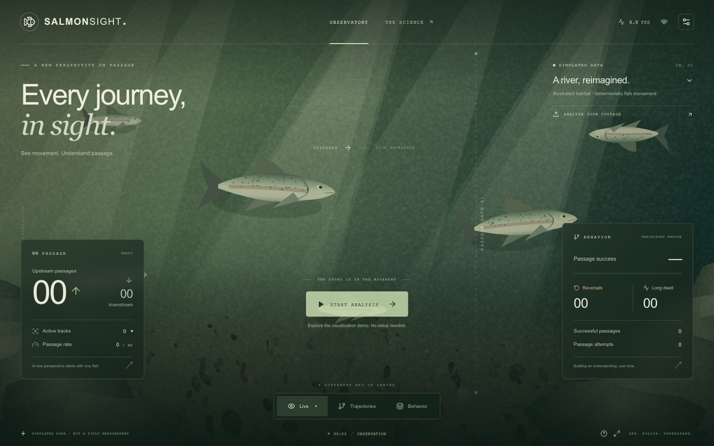
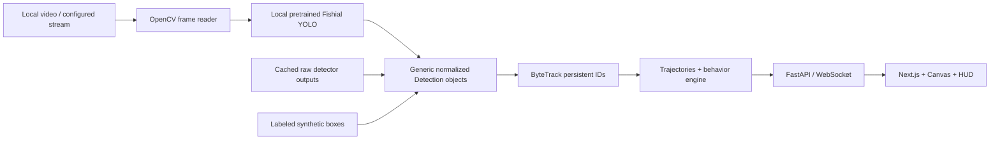

# SalmonSight

**Computer vision for understanding fish passage behavior.** A video-first observatory with local fish detection, individual trajectories, passage events, and interpretable movement observations. The footage fills the viewport; Canvas graphics and translucent telemetry panels sit above it.

> SalmonSight uses an existing pretrained Fishial YOLO fish detector. SalmonSight's contribution is the tracking, passage-event extraction, trajectory analytics, behavior analysis and interactive visualization built on top of detections.

> SalmonSight surfaces movement patterns and behavioral indicators from video. Behavioral anomaly outputs are intended to prioritize human review and should not be treated as biological or engineering diagnoses.

**All detection runs on your machine. No API key, cloud inference, labeling, training, or species classification.** Fishial detects the general `fish` class; a SalmonSight count is not proof that every observed animal is a salmon.

## Run it

Prerequisites: Node.js 20.9+ and either [uv](https://docs.astral.sh/uv/getting-started/installation/) or Python 3.11+. These instructions target macOS/Linux. The initial dependency/model setup requires internet; normal operation does not.

```bash
# Install dependencies and create .env from .env.example
./scripts/setup.sh

# One-time official pretrained detector download (~115 MB archive)
.venv/bin/python scripts/download_model.py

# Start both services
./scripts/dev.sh
```

Open **http://localhost:3000**. Backend/API docs: **http://localhost:8000/docs**. `Ctrl+C` stops both. `make dev` is equivalent. The startup script installs dependencies on first use if needed, but never downloads a detector automatically.

**Fastest demo now:** run `./scripts/dev.sh --offline`, click **Start analysis**, and let the clearly labeled simulation run. It executes actual ByteTrack tracking and behavior analysis on deterministic synthetic fish boxes. The illustrated riverbed and fish require no external images, fonts, streams, or services. An upstream passage appears around 11 seconds; reversals and dwell observations accumulate over the next 15–30 seconds. Use **Trajectories → Reversals**, then **Behavior**, and click a fish box or activity event to inspect its journey.

No Issaquah video is bundled. To analyze real footage, choose **Analyze your footage**, upload an MP4/MOV/AVI, set upstream direction and drag the passage gate, save calibration, then start analysis. The installed Fishial model runs locally. MP4/H.264 is recommended; codec support for MOV/AVI depends on OpenCV.

## Screenshots



[Trajectory view](docs/trajectories.png) · [Behavior view](docs/behavior.png). These are verified application screenshots using **SIMULATED DATA**, not field observations.

<!-- Field-footage screenshot placeholder: capture the observatory with your authorized clip. -->

## Architecture



Python/FastAPI, OpenCV, NumPy, PyTorch/Ultralytics, and supervision ByteTrack form the backend. Next.js, React, TypeScript, and Canvas form the frontend. No database, authentication, or remote infrastructure is required. Sessions live in memory. Source frames and detections are processed together; an MJPEG frame layer avoids browser codec differences and preserves the aspect ratio used by the Canvas object-cover transform.

```text
frontend/               Next.js observatory, Canvas, controls and HUD
backend/app/detection/  Generic Detection/Detector; local Fishial and local YOLO adapters
backend/app/tracking/   ByteTrack adapter; normalized boxes in/out
backend/app/behavior/   Trajectories, crossings, reversals, attempts, dwell, heatmaps
backend/app/video/      Reader, cache verification, simulation and shared processor
backend/app/services/   Bounded sessions and paced analysis tasks
backend/tests/          Deterministic algorithms, API, video/cache and local-model tests
models/                Local checkpoint; weights ignored by Git
data/demo/             Your authorized clip and cached raw detections
scripts/               Setup, launch, model download, precompute and validation
```

## Fishial model setup and attribution

The default checkpoint is the **YOLO26 Fish Detector** published by [Fishial / fish-identification](https://github.com/fishial/fish-identification), under its **Pre-trained Models → Detection** section. The verified archive is [detector_v26_n3.zip](https://storage.googleapis.com/fishial-ml-resources/detector_v26_n3.zip). Its `model.pt` is an Ultralytics-compatible checkpoint; its class mapping is `{0: 'Fish'}`. SalmonSight loads that exact local file, runs `YOLO.predict()` locally, and converts the results to generic normalized `Detection` objects with `class_name='fish'`.

The downloader verifies the archive and checkpoint SHA-256 before publishing `models/fishial.pt`. See [models/README.md](models/README.md) for the verified hash, upstream metadata, and offline ZIP installation. If the release is unavailable or changes, setup stops with an actionable message. A missing/incompatible checkpoint never triggers a COCO download or a training job. The visualization demo remains available; uploaded footage retains its real preview with a model setup message and no fabricated detections.

Fishial project code is published under MIT, copyright © 2021 Wye Foundation – Fishial.AI Project; see its [license](https://github.com/fishial/fish-identification/blob/main/LICENSE). Checkpoint use remains subject to upstream release terms. Ultralytics has AGPL-3.0 / enterprise licensing; see [its license](https://github.com/ultralytics/ultralytics/blob/main/LICENSE). SalmonSight did not create or train the Fishial detector. Tracking, passage heuristics, and visualization are separate from the pretrained detector. No species-classification components are loaded.

## Configuration

Edit `.env` in the repository root. Paths are resolved relative to that root.

```dotenv
DETECTOR_BACKEND=fishial
FISHIAL_MODEL_PATH=models/fishial.pt
INFERENCE_DEVICE=auto
CONFIDENCE_THRESHOLD=0.35
INFERENCE_SAMPLE_FPS=10
DEFAULT_DEMO_VIDEO_PATH=data/demo/salmon_demo.mp4
DEMO_DETECTIONS_PATH=data/demo/detections.json
DEFAULT_STREAM_URL=
REVERSAL_THRESHOLD=0.025
DWELL_THRESHOLD_SECONDS=8
TRACK_HISTORY_LENGTH=600
BACKEND_PORT=8000
NEXT_PUBLIC_BACKEND_URL=http://localhost:8000
```

`auto` selects CUDA, then Apple MPS, then CPU. If automatic accelerator inference fails, the same Fishial weights are retried on CPU. Set `INFERENCE_DEVICE=cpu` explicitly for predictable portability. The HUD reports measured, paced processing throughput, which can be below the source frame rate. Replay slows to the processing rate instead of pretending to process unseen frames. Videos are sampled at the configured inference rate; that rate is not a detector-accuracy guarantee.

`DEFAULT_STREAM_URL` supports an OpenCV-compatible HTTP/HLS/RTSP source configured by the operator when no local demo clip is found. There is no public-stream scraping or discovery. Stream compatibility is best effort; local clips are the reliable stage path. URLs/credentials are not displayed in source labels. The UI uploads footage locally; it has no cloud upload or authentication flow.

## Three honest operating modes

| Mode | Label | Where boxes come from |
| --- | --- | --- |
| Live inference | **LIVE INFERENCE** | Current frames processed by local Fishial YOLO |
| Cached replay | **PREPROCESSED DEMO** | Real raw local detector outputs from the same fingerprinted clip |
| Visualization | **SIMULATED DATA** | Deterministic illustrative fish boxes, never Issaquah measurements |

All three feed the same ByteTrack → trajectory → behavior pipeline. The bottom **Live** button chooses an overlay style; it does not change the operating-mode label. Failures pause real inference with a setup/retry message, preserving the last valid analysis; they do not turn missing frames into measured zero-fish observations. You can explicitly select the visualization demo in the source chooser.

## Offline stage demo with real footage

Place an authorized Issaquah recording at `data/demo/issaquah.mp4` (or set `DEFAULT_DEMO_VIDEO_PATH`). A new default session discovers this asset automatically.

```bash
# After the initial model/dependency installation, this also runs fully offline.
.venv/bin/python scripts/precompute_demo.py \
  --video data/demo/issaquah.mp4 \
  --output data/demo/issaquah_detections.json \
  --sample-fps 10

# Disconnect Wi-Fi, then start without any dependency downloads.
./scripts/dev.sh --offline
```

Precompute stores raw normalized boxes/confidence/class, source frame number and timestamp, source FPS/dimensions, checkpoint identity/hash, and video SHA-256. It contains no completed track IDs, trajectories, counts, or behavior results. An inference/decode failure aborts and preserves any previous complete cache. A cache whose fingerprint does not match the video is rejected. `data/demo/<video_stem>_detections.json` is preferred, then `DEMO_DETECTIONS_PATH`. Replacing the video requires recomputing the cache.

Open the app and verify **PREPROCESSED DEMO**. Calibrate the upstream direction and gate for the actual clip, then click **Start analysis**. Tracking, counting, trajectories, reversals, attempts, dwell, heatmaps, and interaction all execute locally. **Precomputation is optional:** with the local model installed, live inference also works without Wi-Fi. Caching provides stable presentation timing on slower hardware.

For a production frontend without the development compiler, build while preparing the demo:

```bash
npm --prefix frontend run build
# Terminal 1
.venv/bin/python -m uvicorn backend.app.main:app --host 127.0.0.1 --port 8000
# Terminal 2
npm --prefix frontend run start -- --port 3000
```

## Calibration and interaction

Custom footage requires calibration before analysis. Choose left/up/right/down as upstream and drag the two gate endpoints over the image. Coordinates are normalized, so resizing preserves geometry. The gate must intersect upstream movement; a degenerate/parallel gate is rejected. Saving calibration resets tracking and all metrics to avoid mixing different geometries. Optional `entry_zone` and `exit_zone` normalized rectangles may be supplied through the calibration API; the UI uses the gate proxy.

- **Live:** fish boxes, confidence, IDs, smoothed direction, fading trails, gate flashes, and passage HUD.
- **Trajectories:** dimmed footage with journey paths; filter All, Successful, Reversals, Long dwell, or Selected.
- **Behavior:** switch between time-weighted Movement Density and weighted Behavior Friction heatmaps.
- **Click a fish:** focus its trajectory and see direction, observed duration, speed, attempts, reversals, and passage result. Activity events also select a track.

## What the behavior engine measures

- **Direction:** linear regression over roughly 0.65 seconds, followed by exponential smoothing; movement is projected on the calibrated upstream vector. A 0.015 normalized-units/second dead zone suppresses jitter.
- **Gate crossings:** finite line-segment intersection with a spatial dead band, stable-side state, and rearming distance/time. Hovering near the gate does not increment repeatedly; a genuine retreat and recross may produce another event.
- **Reversals:** meaningful previous displacement, a major vector change, sustained confident movement, persistence, and minimum displacement. `REVERSAL_THRESHOLD` controls the displacement threshold; see `reversals.py` for the transparent heuristic.
- **Passage attempts:** meaningful upstream approach within the gate region. Retreat beyond the reset distance rearms the next approach. A valid crossing can complete an otherwise unobserved approach. This is a practical observation heuristic, not a biological model.
- **Dwell:** interpolate observed movement into a 20×12 spatial grid and accumulate per-track cell residence. A long-dwell flag uses the configured limit or, once at least three normal successful passages exist, a measured baseline. The hotspot reports longest single-track cell residence in its neighborhood; a displayed ratio compares this with the median maximum-cell residence of recent normal successful tracks. No baseline ratio appears without sufficient observations.
- **Passage result:** ACTIVE, PASSED, REVERSED, or INCOMPLETE. An upstream gate crossing is the passage proxy; optional entry/exit zones refine it. A passed track stays passed even if it later returns. Counts describe observed crossing events, not unique fish entering a watershed.
- **Success rate:** successful tracks divided by completed tracks plus still-visible successful tracks. Unresolved active tracks are excluded. No value appears when the denominator is zero. Median passage time uses up to 300 recent successful tracks.
- **Passage rate:** upstream crossing events / observed source-video time × 3600. It is an extrapolated hourly rate and can vary sharply at the start of a short clip.
- **Friction:** reversal events contribute 3 grid units, repeated attempts 1.5, excessive residence seconds 1, and sustained low velocity near the gate 0.15 per second. Display normalization exposes relative spatial patterns; it is not a probability or engineering risk score.
- **Congestion cue:** four recently observed tracks remaining near one another for 1.5 seconds generate a throttled review event. This indicates proximity in the image, not physical obstruction.

Distances and speed are normalized image-space quantities, not meters or physical swimming speeds. Trajectories keep up to `TRACK_HISTORY_LENGTH` points; WebSocket paths are reduced to at most 100 evenly sampled points covering that history, and unchanged tracks are omitted from subsequent packets. Up to 120 ended tracks and 200 active tracks are retained on the backend, while lifetime counters continue. The events API retains 100 recent events; WebSocket packets carry the latest 20. Frame resizing preserves bounding-box alignment; occlusion or missed observations can still cause identity switches.

## API

| Route | Purpose |
| --- | --- |
| `GET /api/health` | Local detector/model and demo availability |
| `POST /api/sessions` | Create demo or visualization session |
| `POST /api/sessions/{id}/source` | Upload multipart video (`file`) |
| `POST /api/sessions/{id}/calibration` | Set upstream/gate and optional zones; resets analysis |
| `POST /api/sessions/{id}/start` | Start/resume; restart a completed clip |
| `POST /api/sessions/{id}/pause` | Pause without losing the observation |
| `GET /api/sessions/{id}` | Current snapshot and mode |
| `GET /api/sessions/{id}/summary` | Calculated passage/behavior metrics |
| `GET /api/sessions/{id}/tracks` | Retained complete trajectory histories |
| `GET /api/sessions/{id}/events` | Recent events |
| `GET /api/sessions/{id}/video` | Aspect-preserving processed MJPEG frames |
| `DELETE /api/sessions/{id}` | Release a session |
| `WS /ws/sessions/{id}` | Paced metadata, bounded histories, heatmaps, events |

## Replace the detector

Set `DETECTOR_BACKEND=local_yolo` and `LOCAL_MODEL_PATH=/absolute/path/to/compatible.pt` for another local YOLO detection checkpoint whose general fish class is named `fish`. This adapter rejects generic COCO weights and does no species classification. For a different output format, implement `Detector.detect(frame) -> list[Detection]` in `backend/app/detection` and register it in `factory.py`. Boxes are normalized `[x1,y1,x2,y2]`, confidence is `[0,1]`, and the pipeline's general category is `fish`. ByteTrack and all behavior code remain unchanged. All adapters must raise `DetectorUnavailable` for failures instead of inventing empty measurements.

## Validation and tests

Create a manual ground-truth JSON for the same clip and geometry:

```json
{
  "upstream": 12,
  "downstream": 2,
  "calibration": {"upstream": [1, 0], "gate": [[0.65, 0.12], [0.65, 0.88]]}
}
```

Those are example input values, not benchmark results. Then run:

```bash
.venv/bin/python scripts/validate.py \
  --video data/demo/issaquah.mp4 \
  --ground-truth validation.json \
  --detections data/demo/issaquah_detections.json \
  --output data/validation-report.json

make check
```

Validation reports human and observed gate-crossing counts, absolute/percentage error, separate upstream/downstream counts, tracks produced, and unpaced processing FPS. Zero ground truth yields no percentage. Without a cache, validation runs local Fishial on the clip. There are no fabricated benchmark scores. Synthetic test fixtures validate algorithms/transport only. Backend tests also verify that the installed model runs with network sockets blocked; this smoke test skips if weights have not been installed.

`make check` runs backend tests, frontend lint, TypeScript checking, and a production build. With both servers running, `npm --prefix frontend run test:e2e` checks passage, reversals, selection, filters, heatmaps, calibration, and the mobile layout in Chromium while blocking external browser requests. Install the test browser once with `cd frontend && npx playwright install chromium`. `./scripts/setup.sh` installs pinned backend/frontend dependencies. Uploads are limited to 1 GB and stored under ignored `data/uploads`; remove those files manually when no longer needed. Up to 12 in-memory sessions are allowed; the oldest paused session is evicted when needed.

## Limits and presentation notes

This is a local monitoring prototype. Detection performance depends on visibility, camera angle, turbidity, lighting, scale, and whether the Fishial training distribution resembles the footage. General fish detections cannot establish species. ByteTrack can split or swap identities around overlaps, entry/exit edges, fast movement, and missed detections. Gate/dwell/reversal thresholds need validation for each camera. Full trajectories are bounded; individual track rewind, persistent storage, universal stream compatibility, and biological diagnoses are outside the current scope.

For the presentation: open the clip, check the data-mode label, calibrate, start, show a gate crossing, inspect a fish, switch to trajectories, filter reversals, then open behavior heatmaps. Only describe behaviors actually visible/calculated in that clip. The simulation deliberately includes approaches, reversals, and dwell for demonstrating the interface. End with: **“Salmon cameras already show us fish. SalmonSight turns that footage into an understanding of how fish move through a passage.”**
